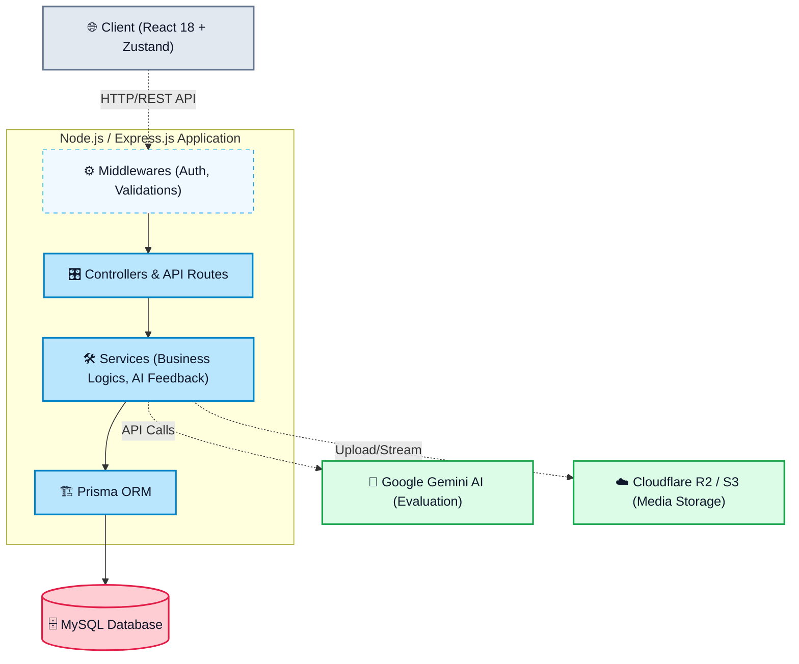

# IELTS Prep Platform 🎓

A comprehensive, AI-powered IELTS preparation web application designed to help students master all four skills (Listening, Reading, Writing, Speaking). The platform uses Google Gemini AI for instant and detailed evaluation of Speaking and Writing responses, providing a highly interactive mock-exam experience.

---

## 🛠 Tech Stack

| Layer | Technology |
| --- | --- |
| **Backend** | Node.js, Express.js |
| **Frontend** | React 18, Vite, TailwindCSS |
| **State Management** | Zustand |
| **Database** | MySQL |
| **ORM** | Prisma ORM |
| **Auth** | JWT (JSON Web Tokens) + bcrypt |
| **AI Integration** | Google Generative AI (Gemini 1.5 Pro / Flash) |
| **Cloud Storage** | Cloudflare R2 (S3-compatible) & Multer |

---

## 📐 Architecture



---

## 📁 Project Structure

```text
IELTS_WEB/
├── backend/
│   ├── src/
│   │   ├── config/            # DB, App, Gemini, JWT configs
│   │   ├── controllers/       # Controller logic (Admin, Auth, Listening, Reading, etc.)
│   │   ├── middlewares/       # Auth, Admin, Role, Error & Rate Limiting
│   │   ├── routes/            # Express route groups
│   │   ├── services/          # Core logic (AI Scoring, R2 Upload, PDF Parsing)
│   │   └── utils/             # Helpers, Band Calculators, Constants
│   ├── app.js                 # Express Application Setup
│   ├── server.js              # Entry execution script
│   └── prisma/                # Prisma schema and migrations
├── frontend/
│   ├── src/
│   │   ├── components/        # Reusable UI (Navbar, Inputs, Spinners)
│   │   ├── features/          # Domain-specific components (Exercise views)
│   │   ├── hooks/             # Custom React Hooks
│   │   ├── layouts/           # MainLayouts
│   │   ├── pages/             # Route Pages (Home, 4 Skills, Practice, Admin)
│   │   ├── store/             # Zustand global stores (Auth, Theme, Progress)
│   │   ├── services/          # API Client and remote requests
│   │   └── utils/             # Formatters, Validation
│   ├── vite.config.js         # Vite bundler config
│   └── jsconfig.json          # Path alias resolution
└── README.md
```

---

## ✨ Features

### Student (Candidate)
- 📝 **Full Mock Exams**: Take complete Reading and Listening tests with automatic grading.
- 🤖 **AI-Powered Evaluation**: 
  - *Speaking*: Record audio → Auto-transcribe → Gemini AI scores & gives feedback.
  - *Writing*: Submit essays → Gemini AI assesses against IELTS rubrics (Task Response, Coherence, Lexical, Grammar).
- 📊 **Progress & Analytics**: View study time, score trends, and skill breakdown statistics.
- 🏆 **Gamification & Badges**: Earn achievements based on study milestones.
- 🔖 **Bookmarking**: Save difficult questions or topics for later review.

### Administrator
- ⚙️ **Content Management**: Create, edit, and organize reading passages, audio clips, and writing prompts.
- 📄 **PDF Import**: Automatically parse IELTS PDFs into structured database tests.
- 👥 **User Management**: Monitor candidate progress and manage platform users.
- 🎫 **Badge & Analytics Dashboard**: Get platform-wide insights into test completion rates and AI usage.

---

## 📦 Getting Started

### Prerequisites
- Node.js (v18 or higher recommended)
- MySQL Server
- Cloudflare R2 / AWS S3 account (for Audio uploads)
- Google Gemini API Key

### 1. Clone the repository
```bash
git clone https://github.com/khoazandev/IELTS_WEB.git
cd IELTS_WEB
```

### 2. Backend Setup
```bash
cd backend
npm install

# Setup Environment variables
cp .env.example .env
# Edit .env with your MySQL URL, Gemini Keys, and R2 credentials

# Initialize Database
npx prisma generate
npx prisma db push

# Start Dev Server
npm run dev
# Server runs on http://localhost:5000
```

### 3. Frontend Setup
```bash
cd ../frontend
npm install

# Start Vite Dev Server
npm run dev
# App runs on http://localhost:5173
```

---

## 🔑 Environment Variables (Backend)

| Variable | Description |
| --- | --- |
| `DATABASE_URL` | MySQL connection string |
| `JWT_ACCESS_SECRET` / `REFRESH` | Secret keys for JWT signing |
| `CORS_ORIGIN` | Allowed domains (default: http://localhost:5173) |
| `GEMINI_API_KEY` | Google AI Studio API Key |
| `GEMINI_SCORING_MODEL` | E.g., `gemini-1.5-pro` |
| `R2_ACCOUNT_ID`, `R2_ACCESS_KEY_ID`... | Cloudflare R2 credentials for media storage |

---

## 🗄 Database Schema (Core Overview)

```text
┌──────────────┐     ┌──────────────┐     ┌──────────────────┐
│     User     │     │ TestAttempt  │     │      Test        │
├──────────────┤     ├──────────────┤     ├──────────────────┤
│ Id           │◄───┐│ Id           │◄───┐│ Id               │
│ Email        │    ││ UserId (FK)  │    ││ Title            │
│ PasswordHash │    ││ TestId (FK)  │────┘│ Level            │
│ Role         │    ││ Status       │     │ Status           │
└──────────────┘    ││ TotalScore   │     └──────────────────┘
                    ││ BandScore    │
                    │└──────────────┘
                    │
┌──────────────┐    │┌──────────────┐     ┌──────────────────┐
│   Profile    │    ││Skill Progress│     │   SpeakingRecord │
├──────────────┤    │├──────────────┤     ├──────────────────┤
│ UserId (FK)  │───▶││ UserId (FK)  │  ┌─▶│ TestAttemptId(FK)│
│ FullName     │    ││ SkillId (FK) │  │  │ AudioUrl         │
│ TargetBand   │    ││ AverageScore │  │  │ Transcript       │
└──────────────┘    │└──────────────┘  │  │ BandScore        │
                    │                  │  └──────────────────┘
                    │                  │
┌──────────────┐    │┌──────────────┐  │  ┌──────────────────┐
│   Writing    │    ││  Listening   │  │  │     Reading      │
│  Submission  │    ││   Attempt    │  │  │     Attempt      │
├──────────────┤    │├──────────────┤  │  ├──────────────────┤
│ TestAttmt(FK)│◄───┼┤ TestAttmt(FK)│◄─┘  │ TestAttemptId(FK)│
│ Content      │    ││ Score        │     │ Score            │
│ BandScore    │    ││ Answers      │     │ Answers          │
│ Feedback     │    │└──────────────┘     └──────────────────┘
└──────────────┘    │
```

---
*Powered by React, Express, MySQL & Google Gemini*
